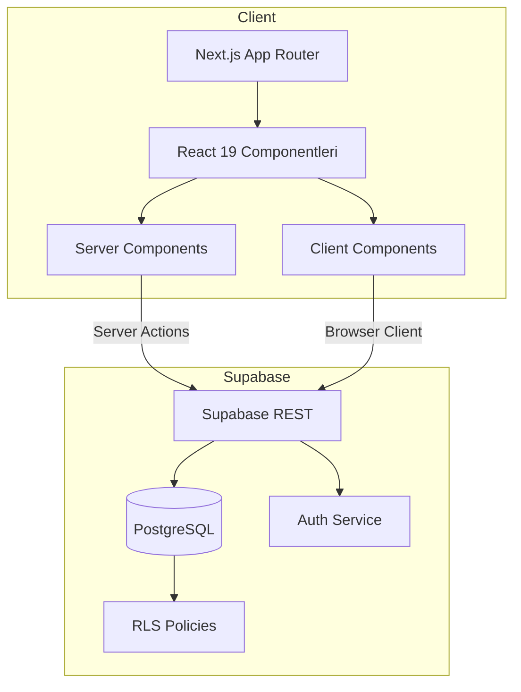

# VivoLearn — Teknik ve Mimari Şartname

## 1. Sistem Genel Bakışı
VivoLearn, Next.js 15 App Router ile inşa edilmiş bir web uygulaması olup Supabase PostgreSQL veritabanı ve Auth servisleriyle çalışır. Uygulama, server komponentleri ve server action'lar üzerinden Supabase'e doğrudan bağlanır; ek bir API katmanı kullanılmaz. RLS (Row Level Security) politikaları uygulama mantığını tamamlayarak rol bazlı erişim kontrolü sağlar.

### 1.1 Mantıksal Mimari


## 2. Modüller ve Sorumluluklar
| Modül | Sorumluluk | Önemli Dosyalar |
|-------|------------|-----------------|
| **Kimlik** | Supabase session yönetimi, profil sorguları | `src/lib/auth.ts`, `src/app/actions/auth.ts` |
| **Kurs Yönetimi** | Kurs, dönem, ders CRUD, başvuru akışı | `src/app/actions/courses.ts`, `src/app/instructor/...` |
| **Quiz** | Quiz oluşturma, soru/şık yönetimi, öğrenci denemeleri | `src/app/actions/quiz.ts`, `src/components/quiz/*` |
| **İlerleme** | Ders tamamlama işaretleme ve profil gösterimi | `src/app/actions/progress.ts`, `src/app/profile/page.tsx` |
| **Admin** | Rol yönetimi, kullanıcı listesi | `src/app/actions/admin.ts`, `src/app/admin/users/page.tsx` |
| **UI Katmanı** | Shadcn tabanlı komponentler, container/layout bileşenleri | `src/components/ui/*`, `src/components/layout/container.tsx` |

## 3. Veri Modeli
Veri modeli `supabase/migrations/0001_init.sql` dosyasında tanımlıdır. Temel tablolar:
- `profiles (id, email, full_name, role)` — Auth kullanıcılarına bağlı profil kayıtları.
- `courses (id, instructor_id, title, slug, summary, is_published)` — Kurs metadata'sı.
- `course_runs (course_id, access_start/end, application_start/end, enrollment_limit)` — Kurs dönemleri.
- `lessons (course_id, title, video_url, order_index, is_published)` — Teorik ders içerikleri.
- `enrollments (student_id, course_run_id, status, receipt_no)` — Başvuru ve kayıt durumu.
- `progress (student_id, course_run_id, lesson_id, is_completed)` — Ders tamamlama bilgisi.
- `quizzes`, `quiz_questions`, `quiz_options`, `quiz_attempts` — Quiz altyapısı.

**İlişkiler**
- `courses.instructor_id → profiles.id`
- `course_runs.course_id → courses.id`
- `lessons.course_id → courses.id`
- `enrollments.course_run_id → course_runs.id`
- `progress` ve `quiz_attempts` tabloları öğrenci ve ders/quiz ile üçlü benzersiz kısıtlar içerir.

### 3.1 ER Diyagram Önerisi
Projede henüz çizim bulunmamaktadır; Lucidchart veya DBML kullanılarak aşağıdaki şema oluşturulmalıdır:
```
profiles 1--* courses (instructor_id)
courses 1--* course_runs
courses 1--* lessons
course_runs 1--* enrollments
course_runs 1--* progress
lessons 1--* quizzes 1--* quiz_questions 1--* quiz_options
quizzes 1--* quiz_attempts
```

## 4. Uygulama Akışları
### 4.1 Öğrenci Başvuru Akışı
1. Öğrenci kurs detay sayfasını açar (`/courses/[id]`).
2. Server component, öğrenci profilini ve mevcut kayıtlarını Supabase'den çeker.
3. Form gönderimi `applyToCourseAction` server action'ı ile yapılır.
4. Action, başvuru penceresi doğrulamalarını gerçekleştirir, `enrollments` tablosuna UPSERT eder.
5. Başarılı işlem sonrası ilgili sayfa segmentleri `revalidatePath` ile yeniden oluşturulur.

### 4.2 Ders Erişimi
1. Öğrenci `/lessons/[id]` sayfasına gider.
2. Server component, ders detayını (`getLessonDetail`) ve öğrencinin onaylı run'ını kontrol eder.
3. Erişim penceresi dışında ise uyarı ekranı gösterilir; aksi halde video embed ve ders listesi render edilir.
4. İlerleme güncellemesi `updateLessonProgressAction` üzerinden yapılır.

### 4.3 Quiz Gönderimi
1. Öğrenci quiz formunu doldurur, client component state'de yanıtlar tutulur.
2. `submitQuizAttemptAction` doğrulama yapar: onaylı kayıt, tüm sorular, doğru seçenek ID'si.
3. Puan `correct/total * 100` formülü ile hesaplanır, `quiz_attempts` tablosuna UPSERT edilir.
4. Sonuç bilgisi istemciye döner, progress ve profil sayfaları revalidate edilir.

## 5. Server Action ve API Tasarımı
| Action | Dosya | Amaç | Giriş doğrulamaları |
|--------|-------|------|----------------------|
| `signInAction` | `actions/auth.ts` | Oturum açma | E-posta/şifre zorunlu |
| `registerAction` | `actions/auth.ts` | Kayıt ve profil oluşturma | Şifre ≥ 6 karakter |
| `createCourseAction` | `actions/courses.ts` | Kurs oluşturma | Eğitmen/admin rolü, başlık zorunlu |
| `createCourseRunAction` | `actions/courses.ts` | Dönem ekleme | Erişim başlangıcı zorunlu |
| `createLessonAction` | `actions/courses.ts` | Ders ekleme | Başlık + video URL |
| `applyToCourseAction` | `actions/courses.ts` | Öğrenci başvurusu | Başvuru penceresi kontrolü |
| `updateEnrollmentStatusAction` | `actions/courses.ts` | Başvuru onayı/ret | Eğitmen sahiplik kontrolü |
| `updateLessonProgressAction` | `actions/progress.ts` | Ders tamamlama | Giriş yapan öğrenci |
| `createQuiz*` & `submitQuizAttemptAction` | `actions/quiz.ts` | Quiz CRUD & cevaplama | Rol, benzersiz quiz, cevap doğrulama |
| `updateUserRoleAction` | `actions/admin.ts` | Rol güncelleme | Admin doğrulaması |

Supabase REST API doğrudan son kullanıcılara açılmaz; tüm kritik işlemler server action'lar üzerinden yürütülür. İhtiyaç halinde Supabase'in otomatik REST endpoint'leri kurum içi entegrasyonlar için kullanılabilir.

## 6. Teknoloji Seçimleri ve Gerekçeler
- **Next.js 15 App Router**: Server-first mimari, route segmentleri, React 19 uyumluluğu.
- **Supabase**: PostgreSQL + Auth + RLS kombinasyonu, minimal backend kodu ve hızlı prototipleme.
- **Tailwind CSS 4**: Tasarım sistemine hız kazandırır, üniversite renk paletine kolay uyum sağlar.
- **Server Actions**: API Routes yerine doğrudan async function çağrıları ile içeride veri güncelleme.
- **UUID Anahtarlar**: Dağıtık sistemlerde benzersizlik sağlar, Supabase `gen_random_uuid` kullanır.

## 7. Dağıtım, Altyapı ve CI/CD
- **Ortamlar**: `development` (geliştirme), `preview` (Vercel preview), `production`.
- **Env Değişkenleri**: `NEXT_PUBLIC_SUPABASE_URL`, `NEXT_PUBLIC_SUPABASE_ANON_KEY`, `SUPABASE_SERVICE_ROLE_KEY`.
- **Dağıtım**: Vercel ile otomatik; build aşamasında `next build` çalışır.
- **Veritabanı**: Supabase yönetimli PostgreSQL; migration'lar SQL dosyalarıyla sürümlenir.
- **CI Önerisi**: GitHub Actions ile `npm ci`, `npm run lint`, `npm run build` adımlarını doğrulayan pipeline.

## 8. Güvenlik, Erişim Kontrolü ve Uyum
- RLS politikaları, sahiplik ve rol bazlı kontrollerle tüm CRUD işlemlerini sınırlar.
- Hizmet rol anahtarı yalnızca server action'larda (ör. profil upsert) kullanılır.
- Admin ve Eğitmen panelleri server component guard'larıyla korunur (`redirect`).
- Quiz ve ders erişimi zaman penceresi kontrolleri ile ek olarak sınırlandırılmıştır.
- Şifreler Supabase Auth tarafından hash'lenir; uygulama düzeyinde saklanmaz.

## 9. Gözlemlenebilirlik ve Loglama
- Server component ve action'larda kritik Supabase hataları `console.error` ile loglanır; Vercel/Edge fonksiyon loglarına yansır.
- Ek loglama gereksinimi doğarsa Sentry veya Supabase Logflare entegrasyonu önerilir.
- Kullanıcıya gösterilen hata mesajları Türkçe ve aksiyonu yönlendiricidir.

## 10. Test Stratejisi (Planlı)
- **Birim Testleri**: Yardımcı fonksiyonlar (`formatDateRange`, slugify) için Jest ile testler planlanmalıdır.
- **Entegrasyon Testleri**: Playwright veya Cypress ile temel akışlar (kayıt, başvuru, quiz) otomasyona alınabilir.
- **Veritabanı Testleri**: Supabase test projesi üzerinde migration ve RLS senaryoları doğrulanmalıdır.

## 11. Ölçeklenebilirlik ve Dayanıklılık
- Supabase, otomatik ölçeklenen PostgreSQL örnekleri sağlar; büyük çaplı kullanımda read replica ve caching (Edge Functions) değerlendirilebilir.
- Next.js tarafında ISR veya route segment caching henüz kullanılmıyor; katalog sayfaları için future work olarak planlanabilir.
- Video dağıtımı Google Drive ile sınırlıdır; bant genişliği sorunları yaşanırsa CDN tabanlı çözüm devreye alınmalıdır.

## 12. Bilinen Sınırlamalar & Gelecek Çalışmalar
- Ödeme doğrulaması manuel dekont numarası ile yapılmaktadır; entegrasyon planlanmalıdır.
- Ders içerikleri için revizyon yönetimi bulunmuyor; versiyonlama eklenmesi önerilir.
- Quizlerde soru bankası ve rasgeleleştirme desteği yoktur.
- Mobil cihazlarda video oyuncusu ileri sarma engeli uygulanmamaktadır; gelecek sprint'te ele alınmalıdır.

