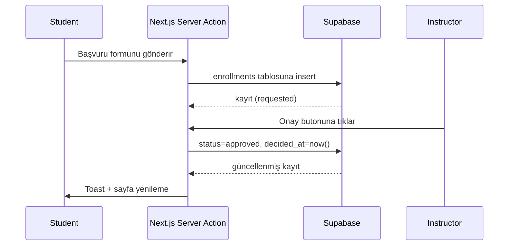

# VivoLearn — Teknik ve Mimari Şartname

## 1. Mimari Genel Bakış
VivoLearn, Next.js 15 App Router üzerine kurulu, Supabase PostgreSQL ve Auth servisleriyle bütünleşik çalışan bir web uygulamasıdır. Mimari, server-first yaklaşımı sayesinde Next.js Server Actions üzerinden doğrudan Supabase'e bağlanır; ek bir backend katmanı gerektirmez.

```mermaid
graph TD
  subgraph İstemci (Browser)
    UI[React 19 Client Components]
    Router[Next.js Route Segments]
  end
  subgraph Sunucu (Vercel Edge/Node)
    SC[Server Components]
    SA[Server Actions]
  end
  subgraph Supabase
    API[Supabase REST & RPC]
    DB[(PostgreSQL)]
    Auth[Auth & RLS]
    Storage[Storage (opsiyonel)]
  end
  UI --> Router
  Router --> SC
  SC --> SA
  SA --> API
  API --> DB
  API --> Auth
```

### 1.1 Ortamlar
| Ortam | Açıklama | Ana Kullanım |
|-------|----------|--------------|
| Development | Yerel Next.js sunucusu, Supabase projesi veya `supabase start` ile lokal eşleniği | Geliştirme ve manuel test |
| Preview | Vercel preview deploy'ları | PR doğrulama |
| Production | Vercel production, yönetilen Supabase instance | Canlı kullanım |

### 1.2 Yapı Taşları
- **İstemci**: React client component'leri form validasyonu, toast bildirimleri ve interaktif bileşenlerden sorumludur.
- **Sunucu**: Server components ve server actions, veri çekme, mutasyon ve RLS kontrollü sorguları yürütür.
- **Veritabanı**: Supabase PostgreSQL, UUID tabanlı şema ve RLS politikaları ile güvenliği sağlar.

## 2. Modül ve Katman Sorumlulukları
| Modül | Sorumluluk | Öne Çıkan Dosyalar |
|-------|------------|--------------------|
| **Kimlik** | Oturum açma/kayıt, profil eşleştirme, session yönetimi | `src/app/login`, `src/app/register`, `src/app/actions/auth.ts`, `src/lib/auth.ts` |
| **Kurs Kataloğu** | Kursları durum bazlı listeleme, detay ekranı, slug yönetimi | `src/app/page.tsx`, `src/app/courses`, `src/lib/courses.ts` |
| **Başvuru & Dönem** | Başvuru formu, eğitmen onayları, kontenjan kontrolü | `src/components/course-application-form.tsx`, `src/app/actions/courses.ts`, `supabase/migrations/0001_init.sql` |
| **Ders & İlerleme** | Video embed, ders tamamlama, ilerleme kaydı | `src/app/lessons`, `src/components/lesson-progress-actions.tsx`, `src/app/actions/progress.ts` |
| **Quiz** | Quiz, soru ve seçenek CRUD'u, öğrenci denemeleri | `src/app/actions/quiz.ts`, `src/components/quiz`, `supabase` quiz tabloları |
| **Admin Paneli** | Rol atama, kullanıcı listesi, sistem görünürlüğü | `src/app/admin`, `src/app/actions/admin.ts`, `src/components/admin` |
| **Eğitmen Paneli** | Kurs/ders/quiz yönetimi için özel ekranlar | `src/app/instructor`, `src/components/instructor` |
| **UI Katmanı** | Ortak bileşenler, grid/typografi, tema | `src/components/ui`, `src/components/layout` |

## 3. Veri Modeli ve Şema
Veri modeli `supabase/migrations/0001_init.sql` dosyasında tanımlanmıştır.

### 3.1 Ana Tablolar
| Tablo | Amaç | Önemli Alanlar |
|-------|------|----------------|
| `profiles` | Auth kullanıcılarına ait profil ve rol yönetimi | `role`, `full_name`, `avatar_url` |
| `courses` | Kurs metadata'sı ve eğitmen ilişkisi | `instructor_id`, `slug`, `is_published` |
| `course_runs` | Dönem bazlı kayıt penceresi ve erişim tarihleri | `access_start`, `application_end`, `enrollment_limit` |
| `lessons` | Ders içerikleri, video URL'si ve sıralama | `order_index`, `is_published`, `content` |
| `enrollments` | Öğrenci başvuru kayıtları ve statüleri | `status`, `receipt_no`, `decided_at` |
| `progress` | Ders tamamlama verileri | `is_completed`, `completed_at` |
| `quizzes`, `quiz_questions`, `quiz_options`, `quiz_attempts` | Quiz kurgusu ve öğrenci yanıtları | `passing_score`, `answers (jsonb)` |

### 3.2 RLS Politikaları
- Tüm tablolar RLS ile korunur; roller `student`, `instructor`, `admin` olarak tanımlıdır.
- Öğrenciler sadece kendilerine ait `enrollments`, `progress` ve `quiz_attempts` kayıtlarını görebilir.
- Eğitmenler sadece sahibi oldukları kurslara bağlı kayıtları listeleyebilir/güncelleyebilir.
- Admin kullanıcılar tüm tablolara genişletilmiş erişime sahiptir.

### 3.3 Tip Tanımları
- `src/lib/database.types.ts` dosyası Supabase tarafından üretilmiş TypeScript tiplerini içerir.
- Server actions ve lib fonksiyonları bu tipleri kullanarak tür güvenliğini sağlar.

## 4. Uygulama Akışları
### 4.1 Server Action Yaşam Döngüsü
1. İstemci formu veya buton aksiyonunu tetikler.
2. Server action giriş verilerini doğrular (Zod veya manuel kontroller).
3. `createServerClient` (`src/lib/supabase-server.ts`) ile Supabase oturumu oluşturulur.
4. RLS politikalarına uygun sorgu veya mutasyon yapılır.
5. Başarılı işlem sonrası `revalidatePath` ile ilgili segment yeniden oluşturulur.

### 4.2 Örnek Akış: Başvurunun Onaylanması


## 5. API ve Entegrasyon Tasarımı
- Harici REST API yoktur; tüm işlevler server actions üzerinden yürütülür.
- Gerekli durumlarda Supabase'in otomatik REST uç noktalarına hizmet rol anahtarı ile erişilebilir.
- Gelecekte üçüncü taraf entegrasyonlar (ödeme, LMS) için `src/app/api` altında EDGE route'ları eklenmesi planlanmaktadır.

### 5.1 Server Action Örnekleri
| Action | Girdi | Doğrulamalar | Çıktı |
|--------|-------|--------------|-------|
| `registerAction` | `{ email, password, fullName }` | E-posta formatı, şifre ≥ 6 | Supabase Auth kullanıcı kaydı + profil upsert |
| `createCourseAction` | Kurs metadata'sı | Rol (`instructor`/`admin`), başlık zorunlu | Yeni kurs ID'si |
| `applyToCourseAction` | `{ courseRunId, receiptNo }` | Başvuru penceresi, benzersiz başvuru | Başvuru kaydı |
| `submitQuizAttemptAction` | `{ quizId, answers[] }` | Onaylı kayıt, tüm sorular cevaplandı | Puan yüzdesi |
| `updateUserRoleAction` | `{ userId, role }` | Admin rolü doğrulaması | Güncellenen profil |

## 6. Kullanılan Kütüphaneler ve Gerekçeler
- **`@supabase/ssr`**: Next.js server/component ortamlarda Supabase oturumlarını güvenli şekilde paylaşmak için.
- **`@dnd-kit`**: Ders ve soru sıralamalarını sürükle-bırak ile yönetmek için hafif ve erişilebilir bir çözüm.
- **Tailwind CSS 4**: Tasarım sistemi oluşturmayı hızlandırır, düşük bakım maliyeti sağlar.
- **`date-fns`**: Tarih aralığı, başvuru penceresi ve zaman damgası formatlama ihtiyaçları için.
- **`lucide-react`**: Tutarlı ve hafif ikon seti; kurumsal temalara uygun.

## 7. Konfigürasyon ve Gizli Bilgiler
| Değişken | Açıklama | Kapsam |
|----------|----------|--------|
| `NEXT_PUBLIC_SUPABASE_URL` | Supabase proje URL'si | İstemci + sunucu |
| `NEXT_PUBLIC_SUPABASE_ANON_KEY` | Anon anahtar; istemci sorguları için | İstemci + sunucu |
| `SUPABASE_SERVICE_ROLE_KEY` | Yalnızca server action'larda kullanılan yetkili anahtar | Sunucu |
| (Opsiyonel) `SUPABASE_DB_PASSWORD` | Yerel Supabase instance için | Yerel |

- Gizli anahtarlar Vercel "Environment Variables" üzerinden yönetilmeli; preview ve production ortamlarında ayrı değerler kullanılmalıdır.

## 8. Dağıtım ve Operasyon
### 8.1 Vercel
- Deploy pipeline'ı `npm install`, `npm run build` aşamalarını otomatik çalıştırır.
- ISR kullanılmadığı için route segmentleri her istekte render edilir; gelecekte seçili sayfalar için caching değerlendirilebilir.

### 8.2 Supabase
- SQL migration dosyaları sıralı olarak `supabase/migrations` altında tutulur.
- Prod veritabanına migration uygulamadan önce staging ortamında test edilmesi önerilir.
- Loglama ve metrikler Supabase dashboard üzerinden izlenebilir.

### 8.3 İzleme ve Uyarı
- Şu anda yalnızca `console.error` logları mevcut; Vercel Log Drains veya Sentry entegrasyonu önerilir.
- Kritik server actions için ölçümler (`duration`, `failure count`) ileride OpenTelemetry ile toplanabilir.

## 9. Ölçeklendirme ve Performans
- PostgreSQL indeksleri (`course_runs.course_id`, `enrollments.student_id`) migration dosyasında tanımlanmıştır.
- Yoğun trafik dönemlerinde Supabase read replica ve bölgesel (Region) seçimleri gözden geçirilmelidir.
- Next.js tarafında streaming server components ve partial revalidation ileride performansı artırmak için kullanılabilir.
- Video servisi Google Drive olduğu için yoğun kullanımda bant genişliği sorunu yaşanabilir; CDN tabanlı çözüme geçiş roadmap'tedir.

## 10. Gelecekte Planlanan İşler ve Bilinen Sınırlamalar
- Ödeme/dekont doğrulaması için banka API entegrasyonu.
- Quiz soru bankası, randomizasyon ve zamanlayıcı modülleri.
- Ders içerikleri için versiyonlama ve değişiklik geçmişi takibi.
- Supabase Storage veya harici CDN ile video yönetiminin kurumsal standartlara taşınması.
- E2E test otomasyonu (Playwright) ve veri tohumlama komutlarının eklenmesi.

